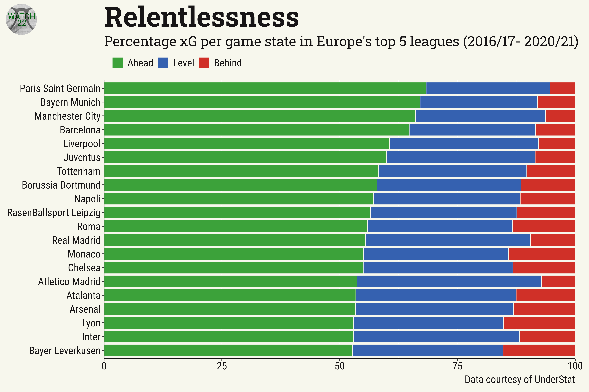
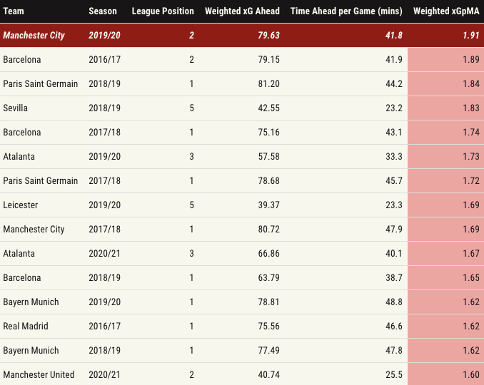
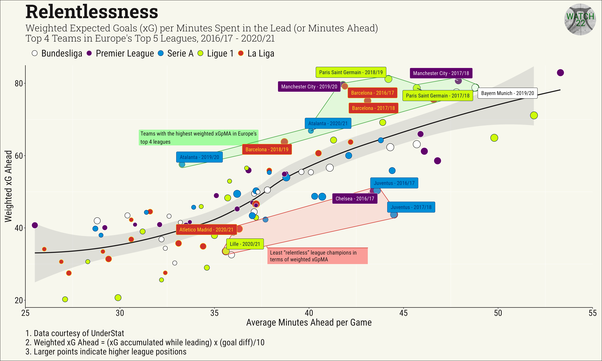
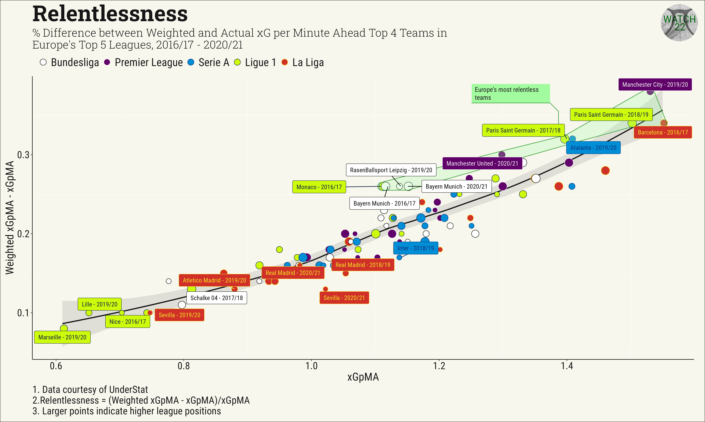

# Deep Dives: Measuring relentlessness (aka Stop! they’re already dead)

Full article here [Part 1](https://medium.com/@watch22/deep-dives-measuring-relentlessness-aka-stop-theyre-already-dead-part-1-e04fc25627a3)

My attempt at defining a metric that describes "relentlessness", basically when a team “opens the floodgates” on their opponent. Those twenty minutes in the first half of Germany’s 7-1 defeat of Brazil are probably the best example in recent memory. 

The way I approached this is by dividing matches into states i.e. level, ahead, and behind, and calculating the xG accumulated during each of these phases as well as the time spent in each of those states.

